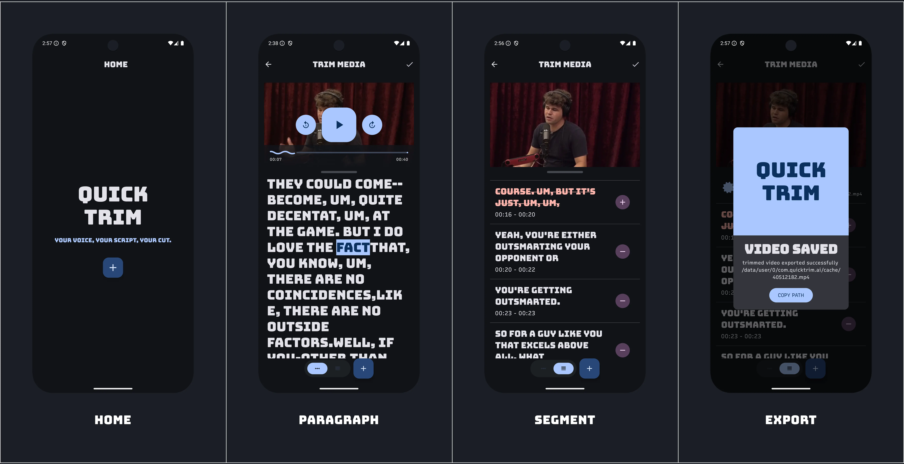

# Quick Trim - AI-Powered Video Trimming App for Android

Quick Trim is an AI-powered Android app that simplifies video editing by automatically identifying and removing filler words, awkward silences, and bad takes. It leverages the Eleven Labs API to fetch transcriptions for precise video slicing. and uses Media3 Transformer for trimming media.

## Features
- [x] **Transcript-Based Video Slicing:**  
  Uses the [ElevenLabs Speech to Text API](https://elevenlabs.io/speech-to-text) to automatically generate transcriptions and enable users to trim videos by word or segment.

- [ ] **Automatic Filler Word, Silence & Bad Take Detection:**  
  Automatically detect filler words, silences, and bad takes

- [ ] **Burn Text**  
  overlay subtitle on video

## 🚀 Project Setup

1. **Clone the repository**
```
git clone https://github.com/nikhil-here/quicktrim-android.git
cd quicktrim-android
```
2. Create `local.properties` 
create a local.properties file in the project root with 
```bash
BASE_URL=https://api.elevenlabs.io/v1/
API_KEY=YOUR_API_KEY
```
3. Get API key
- Generate API keys from [Eleven Labs](https://elevenlabs.io/) and update `local.properties`
4. Run the App
```
./gradlew installDebug
```

## TODO
This application is still a work in progress. I'm actively working on code cleanup, UI improvements, and better error handling to make the app more stable, maintainable, and user-friendly.
- [x] MVP Setup: Getting Things Working
- [ ] UI Enhancements: Adopting the Material 3 Expressive Design System
- [ ] Clean Architecture: Separating Data, Domain, and UI layers; cleaning up ViewModels; removing hardcoded values and flags; making network and transformer modules more flexible
- [ ] Resiliency: Handling errors gracefully and adding fallbacks for audio extraction, transcription generation, and trimming failures
- [ ] Background Services: Using foreground services for long-running tasks to allow users to leave or close the app while operations continue in the background
- [ ] Large Media File Handling: Optimizing chunking and processing of large media files to prevent crashes or stalled operations


